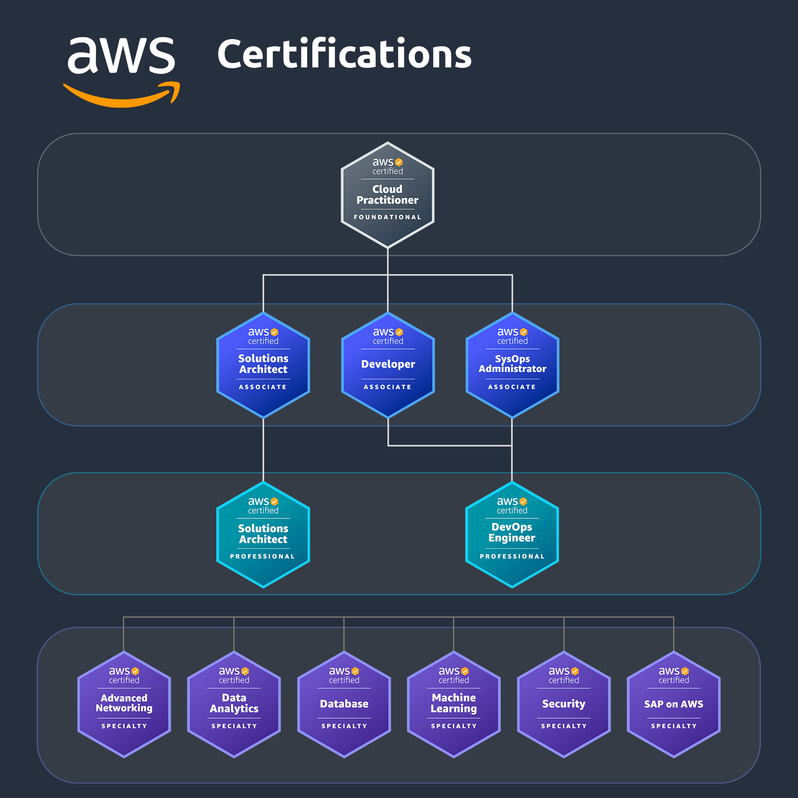
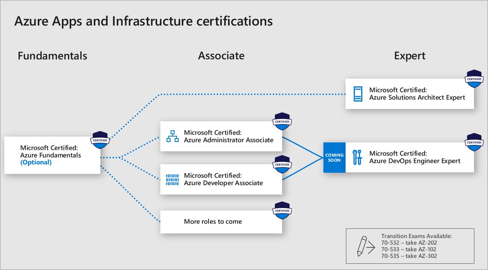
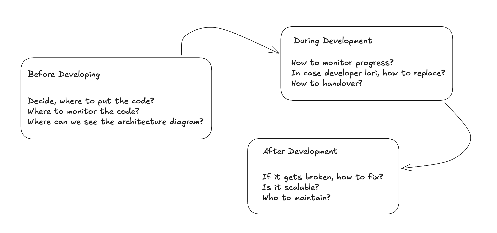
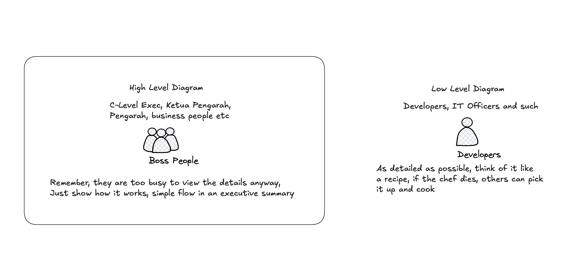

# Solutions Architect Course of Innovative Technology in System Development

- [Solutions Architect Course of Innovative Technology in System Development](#solutions-architect-course-of-innovative-technology-in-system-development)
  - [Overview](#overview)
  - [Module 1:  Introduction to Solution Architect](#module-1--introduction-to-solution-architect)
    - [Solutions Architecture Overview](#solutions-architecture-overview)
      - [Google's Well Architectured Diagram](#googles-well-architectured-diagram)
    - [Well-Architected Framework](#well-architected-framework)
    - [Certifications](#certifications)
      - [AWS Certifications](#aws-certifications)
      - [Azure Certifications](#azure-certifications)
    - [Case Studies and Exercises](#case-studies-and-exercises)
  - [Module 2:  Understanding Business Requirement](#module-2--understanding-business-requirement)
  - [Module 3: Architectural Design Principles](#module-3-architectural-design-principles)

## Overview

1. Introduction to Solution Architect
2. Understanding Business Requirements
3. Architectural Design Principles
4. Documentation Standards and Tools
5. Creating Solution Designs
6. Writing Effective Technical Documentation
7. Review and Validation Processes
8. Case Studies and Real-World Applications

## Module 1:  Introduction to Solution Architect

### Solutions Architecture Overview

Solutions architects are a customer-facing role, owning the overall technical relationship and strategy between the customer and organization. They lead architectural design sessions, develop proof of concepts/pilots, implement projects, and deliver ongoing refinement and enhancement. Responsibilities for this role include advising stakeholders and translating business requirements into designs for secure, scalable, and reliable solutions.

#### Google's Well Architectured Diagram

- Design Secure Architectures
- Design Resilient Architectures
- Design High-Performing Architectures
- Design Cost-Optimized Architectures

### Well-Architected Framework

### Certifications

#### AWS Certifications

Read more: https://aws.amazon.com/certification/

#### Azure Certifications

Read more: https://learn.microsoft.com/en-us/credentials/browse/?credential_types=certification

### Case Studies and Exercises

- Problems that you'd always face in your department
- Narrow down your problem

## Module 2:  Understanding Business Requirement

Remember; What's the Business Value in this ?

Remember to consider this:

## Module 3: Architectural Design Principles

Refer to: https://refactoring.guru

Read more here for High Level Diagram: https://softwaredominos.com/home/software-design-development-articles/high-level-solution-design-documents-what-is-it-and-when-do-you-need-one/

Read here for Low Level Diagram: https://github.com/ashishps1/awesome-low-level-design